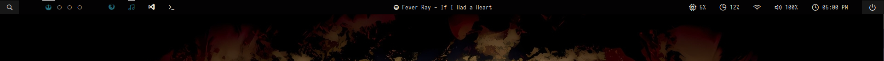

# My Polybar Config
[Polybar](https://github.com/polybar/polybar) lets you create customizable task bars for Linux desktop environments. It comes with many features to show details about widely used services. These include common features that you can probably see on your taskbar right now (start menu, applications, network, sound, clock, etc). It also makes it possible to create custom modules using scripts for functionality.

## My Custom Scripts
1) toggle_app.sh
   - Launches a new application window, minimizes, or maximizes the window.
   - Formats the application icon (background color, underline, etc) according to window status.
3) minimized_windows.sh
   - Displays all minimized windows. Click to restore a window.
  
## Tools Used
### Window Management
- xdotool
- wmctrl
- xprop

## Dependencies
Install [polybar themes](https://github.com/adi1090x/polybar-themes) before trying to use these scripts. 

## Setup
(toggle_app)
- Add script into scripts folder.
- Add the following into your polybar config file.
```
[module/app]
type = custom/script
tail = true
interval = 1 
exec = ~/.config/polybar/docky/scripts/toggle_app.sh "firefox" 
click-left = ~/.config/polybar/docky/scripts/toggle_app.sh "firefox" toggle
```
- Depending on what app you want to launch, edit the first parameter in exec and click-left variables. In this example, I am using Firefox. If you are on Linux Mint, you should be able to use my configuration which is for Firefox, Spotify, VS Code, and terminal. Any other apps will use a default font icon.
- Make sure to edit the get_icon() function in toggle_app.sh and assign font icons to app names ([Font Awesome](https://fontawesome.com/v4/icons/) or [Nerd Fonts](https://www.nerdfonts.com/)).

(minimized_windows)
- Add script into scripts folder.
- Add the following into your polybar config file.
```
[module/minimized]
type = custom/script
interval = 1
format-padding = 0
exec = ~/.config/polybar/docky/scripts/minimized_windows.sh
click-left = ~/.config/polybar/docky/scripts/minimized_windows.sh "restore"
```
- Again, make sure to edit the get_icon() function and assign the proper font icons to each app you want to use. Otherwise, a default icon will be displayed. 

## Customization
- You can use the pre-defined functions (under POLYBAR STYLING FUNCTIONS) in the script to customize how you would like the icon to appear according to it's status. For example, when a window is active, I enable foreground color. When a window is minimized I enable foreground + underline.  



Using [polybar themes](https://github.com/adi1090x/polybar-themes) with [pywal](https://github.com/dylanaraps/pywal) you can choose to use the same color pallette for terminal, code editor, firefox, etc. 
 
