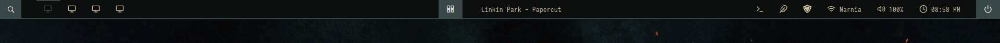
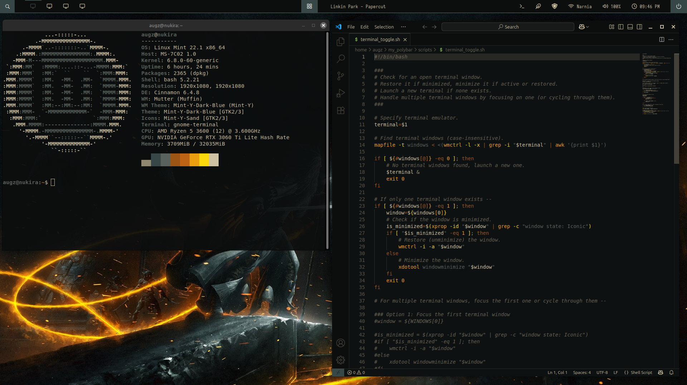

# My Polybar Config

 
 
This is my polybar configuration runnning on Linux Mint. 

[Polybar](https://github.com/polybar/polybar) enables Linux users to create customizable status bars for their desktop environments. It comes with integrated features to show details about widely used services. These include common features that you can probably see on your taskbar right now (start menu, pinned icons, network, sound, clock, etc). More importantly, it gives users the power to create their very own modules using scripts for functionality.

These scripts currently give additional functionality to existing polybar modules. For example, clicking an icon would normally only launch a new window on polybar; I wanted to be able to toggle that window like a normal taskbar would. Also, display minimized windows so they don't just disappear into the void. 

## Custom Scripts
1) terminal_toggle.sh
   - Checks for an open terminal window, minimizes or maximizes it, or launches a new window. If multiple terminals are open, it will cycle through them to check for the most recently activated one.
   - Used with: terminal module (left-click to toggle, right-click to launch another terminal).
2) window_toggle.sh
   - Pretty much does the same thing as terminal_toggle, but can be used for any application (files, Firefox, Spotify, IDE, etc) by utilizing a parameter.
   - Used with: apps-menu module (left-click to toggle).
4) minimized_windows.sh
   - Checks for all minimized windows and maps an icon to it to be displayed on the bar.
   - Used with: minimized-apps module (left-click to restore).
  
## Tools Used
(Window Management)
- xdotool
- wmctrl
- xprop

## Polybar Modules
- Search menu
- Workspaces
- Apps menu 
- Spotify player
- Minimized apps
- System tray
- Network
- Sound
- Settings
- Power menu
- Time
 
 

